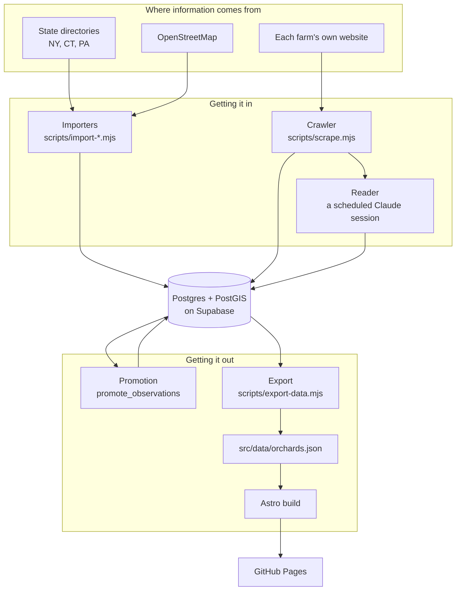

# Orchard Map — how it works

A map of apple orchards within a day trip of New York, at
[minormending.github.io/orchard-map](https://minormending.github.io/orchard-map/).

These pages are for someone who has just cloned the repo. Read them in order
and you will understand the whole system. Every page has **Advanced** sections
you can skip on a first read — open them when you need the detail.

| Page | What it covers |
| --- | --- |
| [The fact pipeline](./pipeline.md) | How a sentence on a farm's website becomes a line on the map |
| [The database](./database.md) | The tables, and why some facts are treated differently from others |
| [Importers](./importers.md) | Where the orchards themselves come from |
| [Scheduled routines](./routines.md) | The two unattended jobs, and the rules they run under |
| [The website](./frontend.md) | Astro, the map, and why the pages are static |

## The one idea

Most of this codebase is arranged around a single sentence, which you will
meet again in the comments:

> A wrong "open" costs somebody a two-hour drive with children in the car.

That is the failure the whole design is trying to avoid. It explains the
confidence thresholds, the `NULL` handling, the separate promotion step, and
why the site would rather say "nobody has checked" than guess. When a piece of
code here looks more careful than it needs to be, this is usually why.

The opposite error — saying nothing when we do know something — is real too,
but it is recoverable. A visitor who is told nothing rings the farm. A visitor
who is told the wrong thing drives.

## The whole system on one page



Two things to notice, because they cause most of the confusion for newcomers:

1. **`src/data/orchards.json` is a build artifact.** It is generated from the
   database. If you edit it by hand, the next export silently overwrites your
   edit. This has bitten three times — see [the pipeline page](./pipeline.md).

2. **The arrows into the database are not the same as the arrows out.** Facts
   go in as *observations*, which are claims with a confidence attached. They
   only become fields on a farm when promotion decides they are good enough.

## Getting it running

```bash
pnpm install
pnpm dev          # the site, at http://localhost:4321/orchard-map/
pnpm test         # unit tests, no database needed
pnpm typecheck
```

The site builds from the committed `src/data/orchards.json`, so **you do not
need database access to work on the front end**. You need it only to run the
importers, the crawler, or the schema tests.

```bash
pnpm db:status            # which migrations are applied
pnpm db:migrate           # apply pending ones
pnpm test:schema          # the database's own tests
```

<details>
<summary><b>Advanced:</b> the database connection, and why there is no local Postgres</summary>

Connection details come from `@minormending/map-kit/node/connect`, which reads
`.env` at the repo root. There is no docker-compose and no local database.

That is a deliberate trade and it has a cost worth knowing about: the schema
tests run against the **real** Supabase project. They are safe because every
test runs inside a transaction that is rolled back, and destructive helpers
refuse to run unless the harness has marked that transaction — see
[the database page](./database.md#testing-against-the-real-database).

The reason for the trade: the schema uses PostGIS, `security definer`
functions, row-level security, and Supabase's `auth.users` table, and a local
shim for the last of those has already produced one false pass. Seven tests
went green locally against a shim where `auth.users.id` had a default, then
failed on the first real project, because in Supabase that column has no
default — GoTrue generates the id. Testing against the thing itself is slower
and occasionally awkward, and it does not lie to you.
</details>

<details>
<summary><b>Advanced:</b> the shared package</summary>

`@minormending/map-kit` is a separate repository consumed as a git dependency.
It holds the parts shared with a sibling project, `restroom-map`: the database
connection helper, the migration runner, a geocoder, and a few React hooks.

It builds on `pnpm install` through its `prepare` script, so a fresh clone does
not need anything special — but if you change map-kit, you must push that
change and re-install here to see it. There is no workspace linking.
</details>
