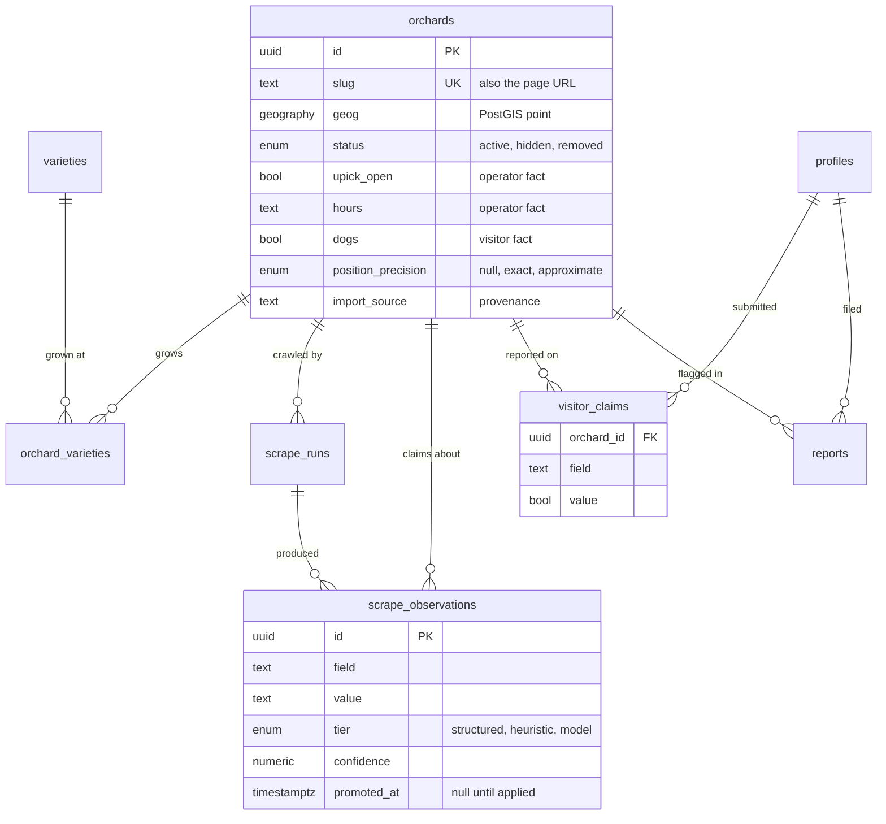
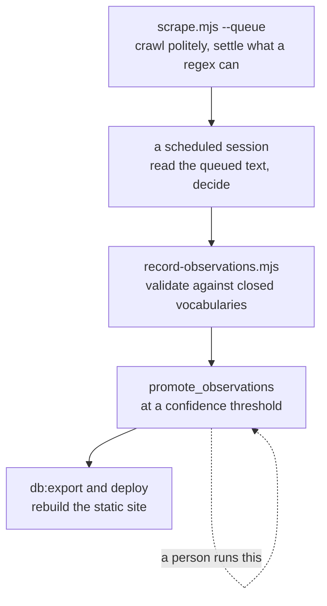
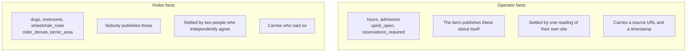
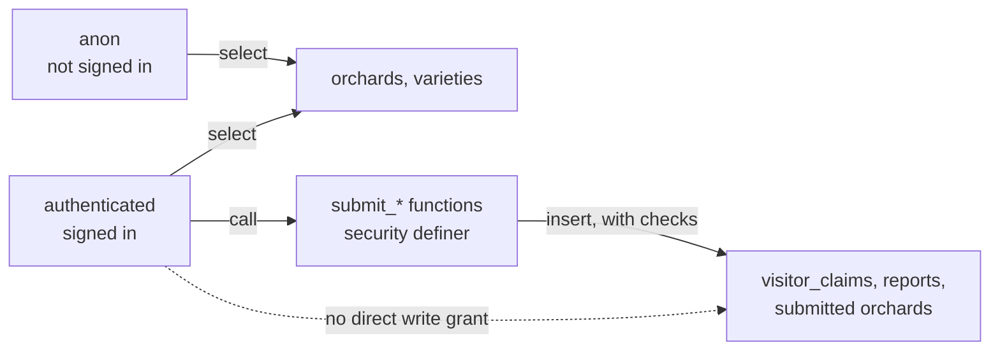
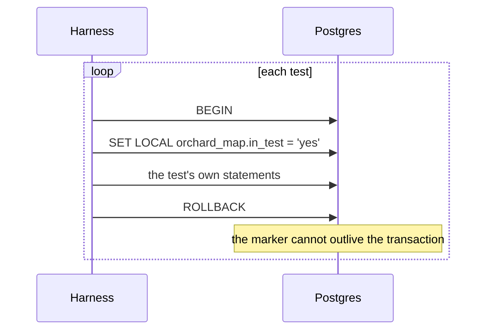

# The database

Postgres 15 with PostGIS, on Supabase. **Live**: 15 migrations applied, 34
behaviour tests passing against the real project.

```bash
pnpm db:status      # what is applied, what is pending
pnpm db:migrate     # apply pending
pnpm test:schema    # 34 behaviour tests, against the live project
pnpm db:verify      # container -> migrations -> seed -> tests, from scratch
```

Only **Google OAuth** remains unproven; it needs credentials created by hand in
Google Cloud Console, and `scripts/configure-auth.mjs --apply` finishes the job.

<details>
<summary><b>Advanced:</b> the four faults container verification caught before any of this was live</summary>

Before there was a project, `pnpm db:verify` ran the migrations against Postgres
15 + PostGIS 3.4 in a container, with a shim supplying what a Supabase project
provides (`auth.uid()`, `auth.users`, the `anon`/`authenticated` roles,
`extensions.pgcrypto`). The first run found four real
faults, every one of which would otherwise have surfaced on a live project:

| | |
| --- | --- |
| `orchards_import_key` was a **partial** unique index | `ON CONFLICT (cols)` cannot use one unless the statement repeats the predicate, so every upsert in the seed failed. The predicate bought nothing — unique indexes already treat NULLs as distinct. |
| `trouble_reporters_90d` counted `closed` as well as `gone` | The exact opposite of what `apply_auto_hide`'s comment promised. Six people reporting a farm shut on a wet Tuesday pushed the score past -6 and the count past 4, so the next single `gone` report hid the farm outright. |
| `promote_observations` broke ties arbitrarily | `created_at` defaults to `now()`, which is **transaction** start time, so every observation from one crawl shares a timestamp. `distinct on` was free to keep a 0.35 regex guess over a 0.8 model reading of the same field. Confidence is now the tie-break. |
| the verification harness itself raced the image's init | The PostGIS image creates the extension on a socket-only server and accepts queries throughout, so a naive readiness poll ran `create extension postgis` concurrently with its own and killed the container. |

The shim had a limit worth remembering: it gave `auth.users.id` a default, so
seven tests passed locally and failed on the first real project, where GoTrue
generates that id and the column has no default. A shim tells you about your
SQL, not about the platform.
</details>

The site does not need any of this. Phase 1 shipped with no database at all,
and `HAS_DB` is false without credentials, which hides every affordance that
would need one rather than showing a button that silently fails.

## The tables



Four views sit on top: `moderation_queue`, `orchard_confidence`,
`visitor_claim_state` and `operator_visitor_conflicts`.

> **`NULL` means nobody has said. It does not mean no.**
>
> The single most important convention here, and the site renders it
> faithfully: an unchecked field shows as "Not checked", never as "No". An
> absent answer is honest; a wrong one costs a drive.

## Getting it running

1. Create a Supabase project. **Do not reuse restroom-map's** — it already has
   `profiles`, `flags`, `feedback`, `rate_limit` and `reports`, and these
   migrations would collide with all five. `revoke all on profiles` and
   `alter default privileges ... revoke` in particular would reach straight
   into a live app.
2. Put the URL, the anon key and the database password in `.env`
   (see `.env.example`). `.env` is gitignored and must stay that way — the
   database password bypasses RLS entirely.
3. Apply and seed:

```bash
pnpm db:migrate
node scripts/seed-to-sql.mjs > supabase/seed.sql
node scripts/db.mjs file supabase/seed.sql
```

4. Point Auth at the site and switch Google on:

```bash
node scripts/configure-auth.mjs            # shows current vs intended
node scripts/configure-auth.mjs --apply
```

   A fresh project ships with `site_url` set to `http://localhost:3000`, which
   is wrong for every deployed site and will bounce somebody to a dead address
   after they sign in — worth fixing whether or not Google is ready. The
   redirect allow list is a wildcard over the whole site, because sign-in
   returns to the page it started from and that can be any of the 199 orchard
   pages.

   The Google OAuth client itself has to be made by hand in Google Cloud
   Console: it is an interactive login against a Google account, there is no
   API for the consent screen, and there should not be one for handing out an
   account's OAuth credentials. The script prints the exact origins and
   redirect URI to paste in.
5. Add `PUBLIC_SUPABASE_URL` and `PUBLIC_SUPABASE_ANON_KEY` as **repository
   variables** (not secrets — the anon key belongs in the bundle) so the
   deployed build picks them up.

## The migrations

| file | what it does |
| --- | --- |
| `…001_kit_rate_limit` | `rl_take`, `client_fingerprint`, salted and unreachable from any client |
| `…002_kit_profiles` | accounts, and a signup trigger that derives a display name |
| `…003_orchards` | orchards, varieties, orchard_varieties |
| `…004_kit_moderation` | flags, feedback, `moderation_queue` |
| `…005_reports` | reports, confidence with decay, auto-hide, `submit_report` |
| `…006_grants` | who may write what |
| `…007_submissions` | `submit_orchard`, visitor claims, the two-people rule |
| `…008_scraping` | scrape runs, observations, `promote_observations` |
| `…009_promote_varieties` | one apple per farm was being kept and the rest discarded |
| `…010_position_precision` | how much a pin is claiming |
| `…011_promoted_at` | promotion remembers what it already applied |
| `…012_promotion_comment` | corrects a wrong explanation in 011, no behaviour change |
| `…013_cast_failure_falls_through` | a value that will not cast no longer blocks its field |
| `…014_field_sources` | per-field provenance, and what dropping a source would cost |
| `…015_submitted_precision` | a submitted pin can say it is a road, and may not say it is exact |

The first two and the fourth are generated from `map-kit` templates by
`scripts/gen-migration.mjs` and then committed as plain SQL. They are written
once and never regenerated: substituting at apply time would make a checksum
depend on the environment, and the runner refuses a migration whose file
changed after it was applied.

That checksum is why `…012` exists. Edit an applied migration and `db:status`
reports it forever:

```
applied (FILE CHANGED SINCE)    20260919000011_promoted_at.sql
```

So a mistake in an applied migration is corrected **forward**. `…012` changes
no behaviour at all; it recreates the function so its body stops carrying an
explanation that was wrong about which mechanism protects what.

<details>
<summary><b>Advanced:</b> is a migration that only fixes a comment worth the noise?</summary>

Here, yes. The comment defended a non-obvious choice — that promotion picks its
winner across all observations rather than only unpromoted ones — and defended
it with an example that did not hold. A comment that misdescribes the rule it
guards is worse than no comment: it is exactly the reader who needs it who
would be talked into "simplifying" the thing it was protecting.

Postgres stores function bodies, so the wrong text was also live in the
database and visible to anyone running `\sf promote_observations`.
</details>

## From a crawl to the map

Five steps, and each boundary is a place a wrong "picking is open" can be
stopped before somebody drives two hours on it.



**[The fact pipeline](./pipeline.md) covers each step in detail.**

Nothing a visitor reads changes until the last step. The export is deliberately
not something the reader does.

```bash
node scripts/export-data.mjs            # says what would change
node scripts/export-data.mjs --apply
pnpm build
```

Hidden and removed orchards are simply left out of the export, which is how a
soft delete reaches the map: the row and its history stay in the database, the
pin stops being published.

## The two field classes

This is the part worth understanding before changing anything.



`restroom-map`'s rule is that **two people who independently agree settle a
field**. That is right when nobody publishes the answer — no dataset says
whether a toilet has grab bars.

Orchards are different, and only half different. The farm publishes its own
opening hours; one reading of the farm's own website beats two strangers
guessing. But the same farm's site says "open 9–5" on a day the car park filled
at eleven and they turned people away.

So:

| class | examples | settled by |
| --- | --- | --- |
| **operator fact** | hours, picking open, admission, reservations | the farm's own site, via the scraper, with `operator_source_url` and `operator_checked_at` |
| **visitor fact** | dogs, restrooms, stroller-passable rows, cider donuts | two independent agreeing claims |

A conflict between them is **shown, not resolved**: *"The farm says open 9–5.
Two visitors reported it picked out on Sunday."* That is more useful than
either alone, and hiding the disagreement is how the wasted trip happens.

## What is different from restroom-map, and why

**Auto-hide is harder to trigger.** `restroom-map` hides at `score < -3` with 3
distinct reporters. Here it is `score < -6` with 4, and only `gone` counts —
not `closed`, not `busy`, which are facts about a day rather than about whether
the farm exists. An orchard is a named business with a findable address;
wrongly hiding one is a worse error than wrongly hiding a public toilet, and a
competitor will try.

**The geo-verification radius is 800m, not 150m.** A farm is a big place and
its car park is not its centroid.

**Reports need no account.** It is the highest-volume, lowest-risk signal
available, and a sign-in wall would remove nearly all of it.

## The rule that keeps the doors shut

> A table with a `submit_*` function in front of it has no write grant.



So a signed-in user cannot insert a row directly. They call a function that
decides what is allowed: five submissions a day, no second vote from the same
person on the same field, a submitted orchard landing `hidden` rather than
`active`, and a duplicate within 300m refused **with the neighbour named** —
refusing without saying what it collided with just produces a user who submits
it again.

`…006_grants.sql` is mostly `revoke`, and that is not paranoia. Supabase ships
default privileges granting the API roles everything on new tables in `public`.
A table created and left alone is one that anybody holding the anon key — which
is in the bundle, by design — can insert into directly, skipping every rate
limit above it.

`restroom-map` shipped exactly that hole on `flags`, the table that receives
takedown requests. Two things that both looked like access control were sitting
there and neither checked the thing that mattered.

**When testing this:** a missing grant and an RLS refusal are both error
`42501`. Assert the *message* — `permission denied for table` is the grant,
`violates row-level security policy` is the policy. A test asserting only the
code passes against the broken schema.

And a permission test must actually `set local role anon`. Setting the JWT
claim alone leaves the connection as the owner, which bypasses grants and RLS
entirely — such a test passes no matter what the schema says. `asRole()` in
`scripts/test-schema.mjs` does the former; `become()` does only the latter and
is for identity, not permissions.

## Testing against the real database

`pnpm test:schema` runs 34 behaviour tests against the actual Supabase project.
There is no local Postgres for day-to-day work — see the Advanced note at the
top of this page for what a shim got wrong.



Writes are isolated by the rollback. **Reads are not**, and that is subtle
enough to have cost two days of red tests with nobody's code being wrong.

`promote_observations()` reads the whole table. So a test inserting one
observation and asserting `promoted === 0` was really asserting that nothing
anywhere in the database was promotable — true on an empty database, false from
the first scrape onwards. It returned 100.

Such tests now empty `scrape_observations` first, inside the transaction, so
the counts mean what the assertions say.

<details>
<summary><b>Advanced:</b> guarding a delete that points at production</summary>

`delete from scrape_observations` in a test file is a loaded gun, and the only
thing keeping it pointed at the floor is a `rollback` in a different function
twenty lines away. That is too much to leave as a convention, so the harness
marks its transaction and the helper refuses to run without the mark:

```js
const { rows } = await client.query(
  `select current_setting('orchard_map.in_test', true) as marked`)
if (rows[0].marked !== 'yes') {
  throw new Error('refusing to delete observations: not inside the test harness transaction')
}
```

`SET LOCAL` cannot outlive its transaction — verified in all three states:
empty outside a transaction, `yes` inside, empty again after the rollback. So
calling this from a script, or losing the rollback, produces an error rather
than an empty table.
</details>

Two further ways a test here can pass without testing anything — asserting the
error code instead of the message, and setting a JWT claim instead of the role
— are covered under
[the rule that keeps the doors shut](#the-rule-that-keeps-the-doors-shut).
