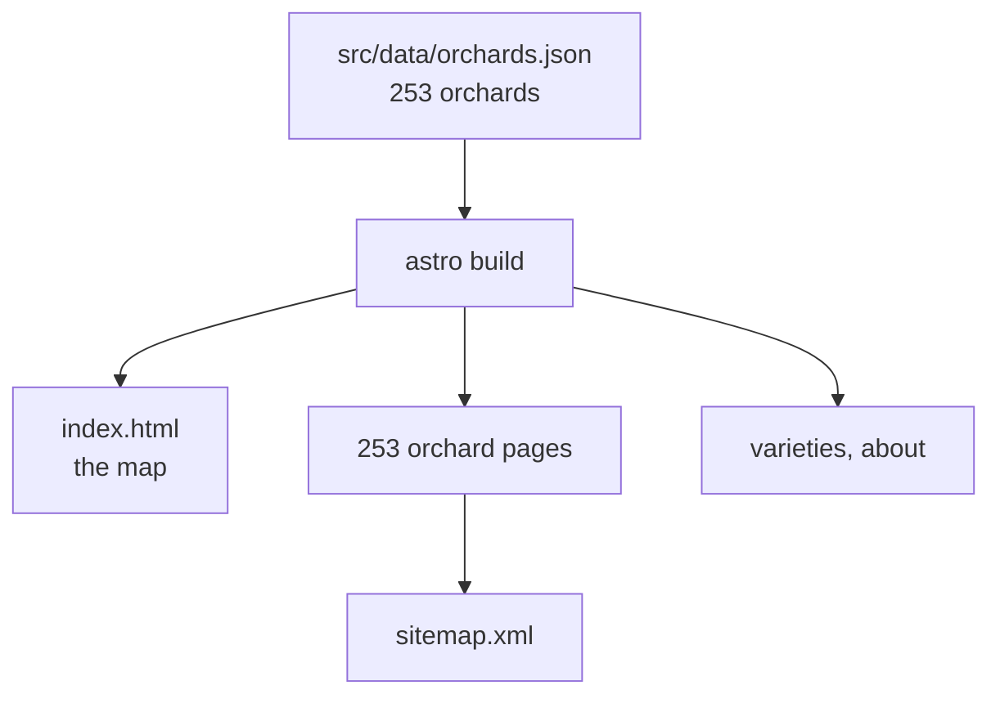
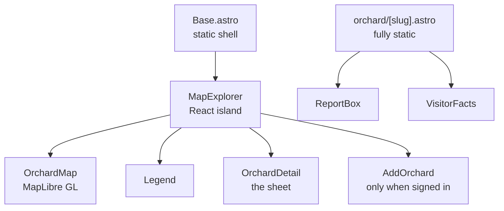
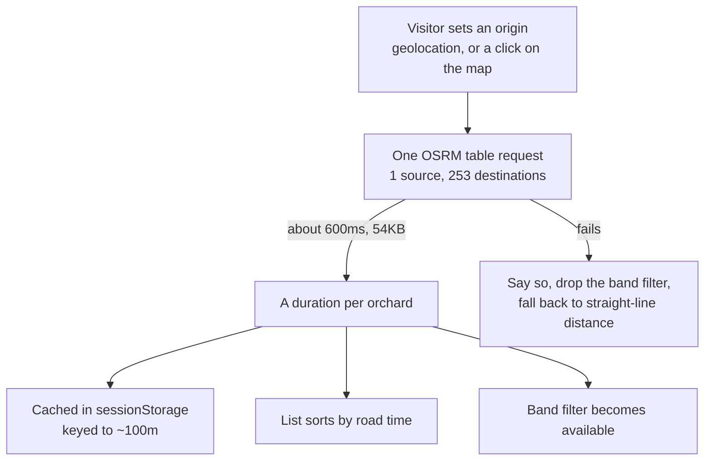
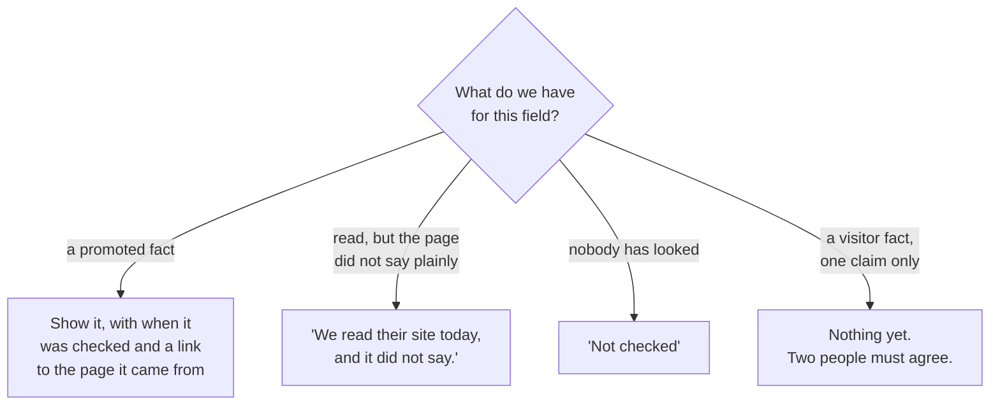
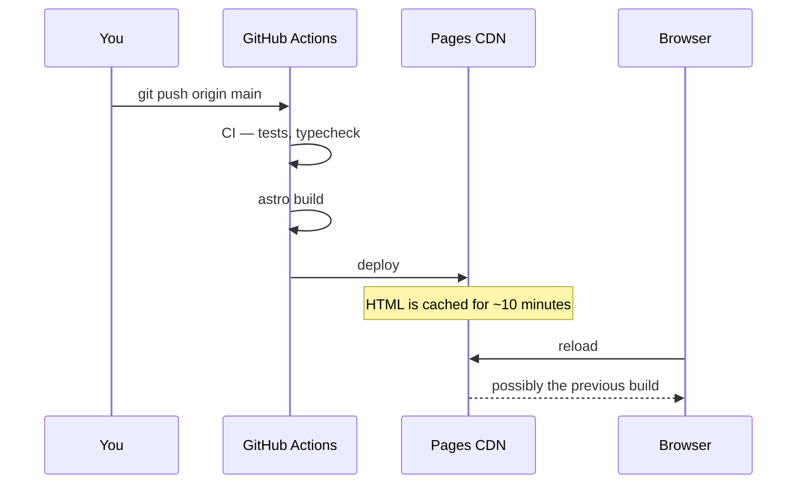

# The website

Astro 5, static output, React islands, MapLibre GL, deployed to GitHub Pages.

```bash
pnpm dev    # http://localhost:4321/orchard-map/
pnpm build
```

You do **not** need database access to work on the front end. The site builds
from the committed `src/data/orchards.json`.

## Why static, and why a page per orchard



"apple picking warwick ny" is the query that matters, and a single-page app
cannot rank for it — there is one URL and its markup is a loading state. The
253 orchard pages are the crawlable surface; the map is the tool people use
once they have arrived.

That is also why there is no database call at request time. A page that renders
nothing without one ranks for nothing.

## Islands

Most of the site is HTML. Four things need to be interactive, and only those
ship JavaScript.



The orchard pages are static HTML with two small islands for the parts that
need an account. Everything a search engine or a reader without JavaScript
needs is in the markup.

## What the dots mean

The colour of a dot is the only thing distinguishing one kind of farm from
another at a glance, which makes the palette a functional decision rather than
a decorative one.

| Colour | Meaning |
| --- | --- |
| Red `#C2384A` | Pick your own |
| Amber `#C8792A` | Cider, no picking |
| Slate blue `#3A6E8F` | Not known yet |

A **hollow** dot of any colour means the position is approximate — the right
road rather than the front gate. See
[importers](./importers.md#when-the-pin-is-only-a-road).

`src/lib/kinds.ts` is the single definition. The MapLibre paint expression and
the legend both read it, so a legend that quietly stops matching the map is not
a thing that can happen.

<details>
<summary><b>Advanced:</b> the palette is enforced by a test</summary>

It was red, amber and green until `test/kinds.test.mjs` existed, which put the
two most important categories — "you can pick here" and "we do not know" — on
the classic red-green confusion pair. Roughly one man in twelve has some form
of red-green colour blindness, and at seven pixels across the two were close in
lightness as well.

The test simulates protanopia, deuteranopia and tritanopia using the
Viénot–Brettel–Mollon method, converts to Lab, and fails if any two categories
come out closer than ΔE 20. Measured: red against the old green scored **10**
under protanopia. Red against the current blue scores 40.

It ends with a check that the *old* palette fails, so if the simulation ever
stops doing anything the test says so instead of passing vacuously.

The amber survives because it separates from the red by lightness even when
both lose their hue.
</details>

## Driving time

A visitor can say where they are travelling from, and the list re-sorts by road
time with a filter at 45 / 60 / 90 / 120 minutes.



Three things about this are deliberate.

**The number has no traffic in it.** OSRM returns free-flow road time, and the
Saturday morning in late September when everybody drives to the Hudson Valley
is exactly when that is most wrong. Every label says **"without traffic"**, and
a test asserts the phrase is still attached to the number — a confident
"1h 47m" that is really two and a half hours is the sort of claim this map
refuses everywhere else. Times are rounded to five minutes above an hour for
the same reason.

**The origin is not the visitor's location.** `here` is the device's position
and is passed to the report box, where it checks that somebody saying "I was
here today" was. `origin` is a pin dropped anywhere. Letting them be one value
would turn a travel-planning control into a way to claim you are standing in an
orchard you have never visited.

**Failure is visible.** The demo server offers no uptime guarantee, so when the
request fails the band chips are removed rather than left dead, the panel says
drive times are unavailable, and the list falls back to straight-line distance.
A farm with no duration fails the band filter rather than passing it: showing
it would put a farm in a "within 60 minutes" list without anybody having
established that it is.

<details>
<summary><b>Advanced:</b> why this service, and is it worth it over the distance sort?</summary>

**Why OSRM.** The routing service gets the same test as a data source: it has
to be one that can be named on the About page. This is the FOSSGIS-sponsored
demo server on OSM data, whose terms are non-commercial, reasonable use and no
more than one request a second. Google Directions fails that test for exactly
the reason the importers refuse Maps. One matrix call per origin — not per
farm, not per frame — is lighter than the map tiles a visitor is already
pulling.

**Is it worth it?** Genuinely, but modestly. Measured from Manhattan against
the real dataset, ranking by road rather than by crow moves farms up to 40
places:

| farm | crow | road | |
| --- | --- | --- | --- |
| Twin Star Farms | 117km | 106min | 40 places nearer |
| Wahoo Farm Market | 150km | 180min | 36 places further |

And within a single 10km band the drive ranges 82 to 104 minutes. So
straight-line distance was already getting most of the way there, which is why
it remains the fallback rather than being ripped out.
</details>

## Telling people what is not known

The site's hardest design problem is not showing data. It is showing the
absence of data without either implying "no" or implying nothing is known.



Checked-and-ambiguous is a third answer and reads as one. An earlier version
said "nobody has checked" next to "read from their website today", which is a
contradiction a reader notices immediately.

<details>
<summary><b>Advanced:</b> the sentence that took three attempts</summary>

`src/lib/checked.ts` builds the "what the farm says" line, and its wording has
been wrong twice.

The field is `upick_open`, and the question is what it *means*. Version one
read it as "is the gate open right now", which forced a bad choice for a farm
whose site plainly says "open weekends 10-5 through October" read on a
Thursday: either assert they are open today, or record nothing and tell a
visitor the site "did not say plainly" when it had said so very plainly.

It now means **the season**, and when they are actually open lives in `hours`,
in the farm's own words, printed directly below it. Two fields, two questions,
neither pretending to answer the other:

> Their own site says picking is on this season, read today. Check the hours
> below before going.
>
> **Opening hours:** PYO is weather permitting from 10am-4:45pm WEEKENDS ONLY.

Read on a Friday, both sentences are true and neither had to lie for the other.
</details>

## Deploying, and the version tag

Pushing to `main` builds and deploys to GitHub Pages.



That cache is a real trap. A deploy can be finished and green and still be
invisible in an open tab, and an ordinary reload happily serves the cached
document again.

The small number in the header — `v41` — is the build. It is
`git rev-list --count HEAD`, so v41 is the 41st commit and maps back to exactly
one:

```bash
git rev-list --reverse HEAD | sed -n '41p'
```

Clicking it forces the document itself to be refetched rather than revalidated.
Hashed assets need no special handling: once the HTML is current it references
new filenames.

<details>
<summary><b>Advanced:</b> verifying a deploy actually landed</summary>

Checking that Actions went green is not the same as checking that the thing
you wanted is live. The reliable sequence is to wait on the specific commit and
then poll the CDN for the build number:

```bash
SHA=$(git rev-parse HEAD)
until [ "$(gh run list --limit 6 --json headSha,status \
  --jq "[.[]|select(.headSha==\"$SHA\")|.status]|unique|join(\",\")")" = "completed" ]; do
  sleep 20
done
curl -s "https://minormending.github.io/orchard-map/?cb=$RANDOM" | grep -o 'data-build="[^"]*"'
```

The cache-buster matters. Without it you may be reading the same cached
document you were before, and conclude the deploy failed.
</details>
