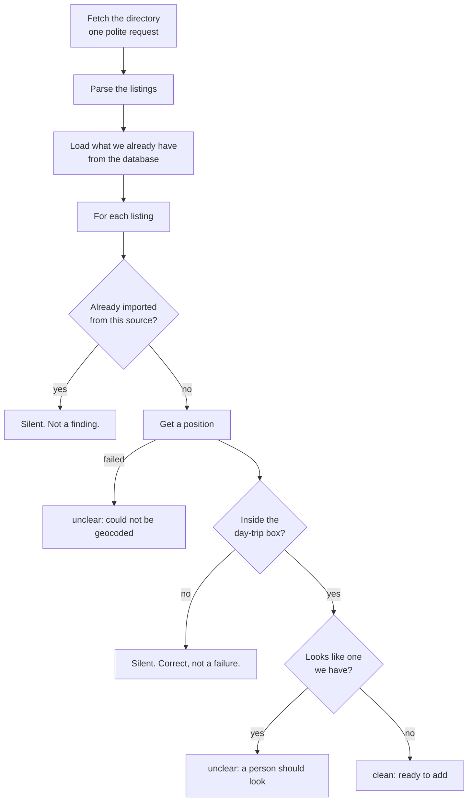
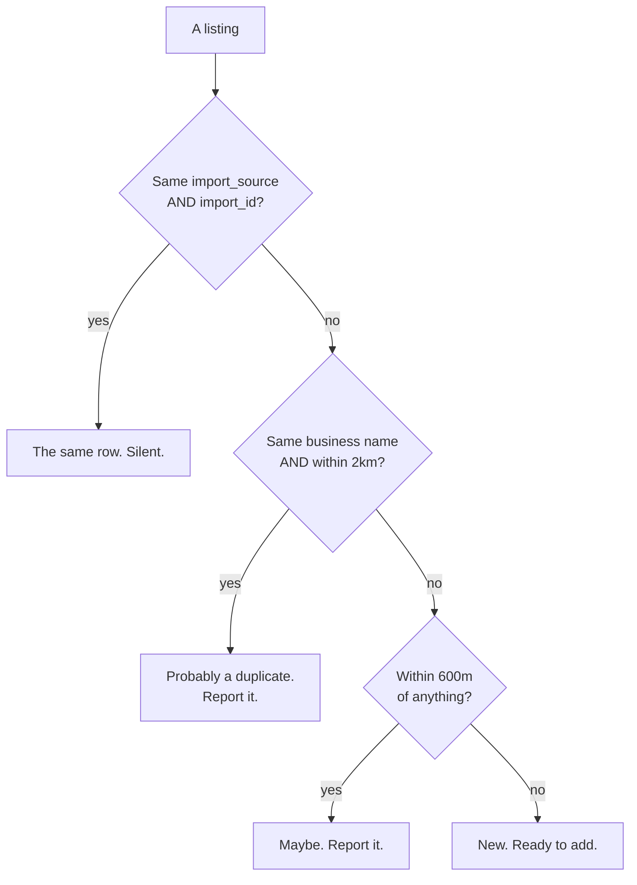
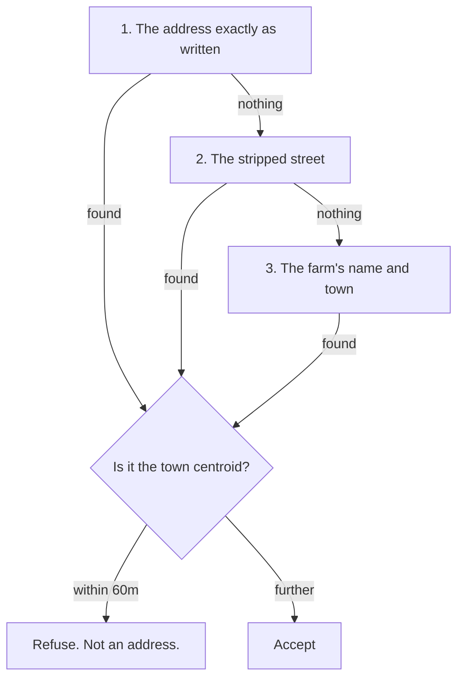
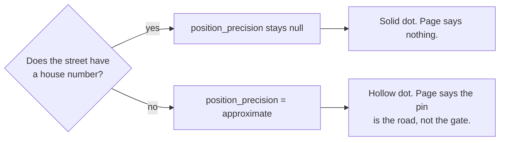

# Importers

Where the orchards themselves come from. The [pipeline](./pipeline.md) is
about *facts* on a farm; this page is about the farms existing at all.

## The four sources

| Script | Source | Rows | Licence |
| --- | --- | --- | --- |
| `import-nyaa.mjs` | New York Apple Association | 188 | none stated |
| `import-ctapples.mjs` | Connecticut Apple Marketing Board | 40 | none stated |
| `import-papreferred.mjs` | PA Preferred | 14 | none stated |
| `import-osm.mjs` | OpenStreetMap | 10 | ODbL 1.0 |

Every row records `import_source`, `import_id` and `import_licence`, so
withdrawing a source is one filter rather than an archaeology project. The
About page publishes all four, and each orchard page credits the one that
listed it.

<details>
<summary><b>Advanced:</b> the sources that were refused, and why</summary>

**Google Maps and Google Places.** Maps' terms prohibit extracting Content and
prohibit using it to build a substitute for Maps, which is exactly what a
public orchard directory assembled from its listings would be. This is a
contractual obstacle, not a copyright one, so "it's only three coordinates" and
"it's personal use" do not help — the repo is public and the site is indexed.

**Third-party u-pick aggregators.** A subtler version of the same objection:
their compiled listings are their product, and copying one to build a competing
directory is the thing this project would not want done to it.

**findjerseyfresh.com.** A plain `Disallow: /` in robots.txt. That is the whole
reason, and it is sufficient.

There is a practical consequence worth understanding before you propose a new
source. Every row carries a licence that the About page names. A row from a
source that cannot be named has nowhere honest to sit in that column — it
would have to be labelled as something it is not, which would quietly make the
provenance promise untrue for every other row too.
</details>

## What an importer does



Every importer is a **dry run by default**.

```bash
node scripts/import-ctapples.mjs              # say what it would do
node scripts/import-ctapples.mjs --candidates # write the unclear ones for review
node scripts/import-ctapples.mjs --apply      # add the clean ones to the database
pnpm db:export -- --apply                     # publish them to the site
```

> Importers write to the **database**, never to `src/data/orchards.json`. All
> four used to write the file, and a farm added that way lasted until the next
> export and was then silently deleted.

## Deciding what is a duplicate

This is the part that has been wrong most often, and the rules are shared in
`scripts/lib/directory.mjs` so there is one copy of them.



Three rules, and each one is there because its absence caused damage:

**Identity is exact, on the import id.** Not on resemblance. Keying idempotency
off the fuzzy matchers meant a genuinely new farm that merely looked like one we
had was reported as "already imported from this source" and vanished from the
candidates file — invisible to the review that exists to catch exactly that.

**A shared name only counts within 2km.** Farms in this trade are named after
families. With generic words stripped, "Rose Orchards" becomes `rose`, which is
a prefix of "Rose Hill Farm" → `rose hill`. Those are ninety miles apart in
different states, and on 2026-09-18 three real Connecticut farms were deleted as
duplicates of farms they have nothing to do with.

**Proximity alone is only a question.** Two real farms can share a village, and
a geocoder falling back to a town centre puts both on the same point.

> `place()` never decides to drop anything. A reason is an invitation for a
> person to look, not a verdict. The three farms above were lost because a
> person — me — treated a flag as a verdict without looking.

<details>
<summary><b>Advanced:</b> why 2km, and why Bishop's Orchards is the fixture</summary>

The bound has to sit above geocoder slop and below the distance between two
genuine sites of one business.

Bishop's Orchards keeps Guilford and Northford about eight miles apart, and
this map lists both, correctly — they are two places you can drive to. A name
match must not collapse them. Meanwhile a geocoder handed a named farm can
land at the end of its drive or at the road it is addressed from, which is
hundreds of metres, not kilometres.

2km sits comfortably between. `test/directory.test.mjs` pins both ends with the
real names and real coordinates, and finishes with a check that the *old* rule
would have failed the same fixtures — so if the test ever stops exercising the
bug, it says so out loud instead of passing for the wrong reason.
</details>

## Geocoding, and a trap inside it

Only Connecticut needs geocoding. PA Preferred publishes each member's
coordinates in a `data-gis-location` attribute, and OSM nodes are surveyed.

State directories write addresses for somebody *driving there*, not for a
parser:

```
403 Orchard Hill Road (Rte. 169)
1393 North Road, off Rte. 101
Rt. 322 Meriden-Waterbury Road
```

Photon takes the whole string literally and finds nothing, so three of
Connecticut's farms reported `could not be geocoded` every week for a month.
`streetForGeocoder()` strips the driver's aside, and the queries are tried in a
specific order:



<details>
<summary><b>Advanced:</b> both halves of that ordering are load-bearing</summary>

**Why the raw address goes first.** Photon is an autocomplete. `185 West Road
(Rte. 83)` finds Johnny Appleseed Farm while `185 West Road` finds nothing —
the route number is noise to a parser and a clue to a fuzzy matcher, and which
one it is cannot be known in advance. Asking in this order means every lookup
that already worked returns exactly what it did before, and the second query is
only ever spent on a listing that was about to be reported as unplaceable.

**Why the town-centroid guard exists.** Adding that second query also gave
Photon a second chance to answer with a *locality*. For Defazzio Orchard it
did: `1393 North Road, East Killingly, CT, 06243` returns the exact centre of
East Killingly, byte-identical to querying the bare town name. A locality
centroid is the worst answer this map can hold, because nothing about it looks
wrong — it renders as an ordinary pin and Directions navigates to the
coordinate. So a result within 60m of the town's own centroid is refused and
the farm goes back to being honestly unplaceable.

60m is deliberately tight. The two farms this does *not* catch sit 6.4km and
5.7km from their town centres, so there is a lot of room between a real address
and a centroid and no reason to spend any of it.
</details>

## When the pin is only a road

Some farms are genuinely addressed from a route and have no house number. The
best available position is a point on the named road, which may be a mile from
the gate.

Rather than publishing that as though it were exact, or withholding it, the row
carries `position_precision = 'approximate'`:



`null` is **not** a synonym for `exact`. It means nobody recorded a precision,
which is where every other row sits. Backfilling the whole table as exact
would have been inventing assertions to avoid a nullable column.
