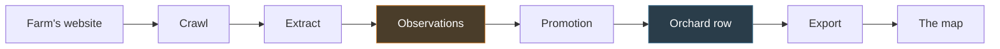
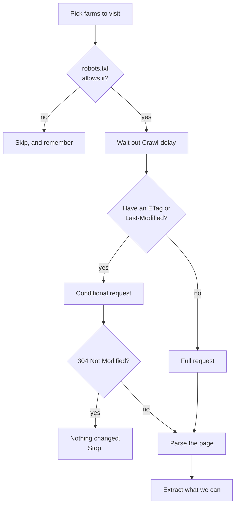
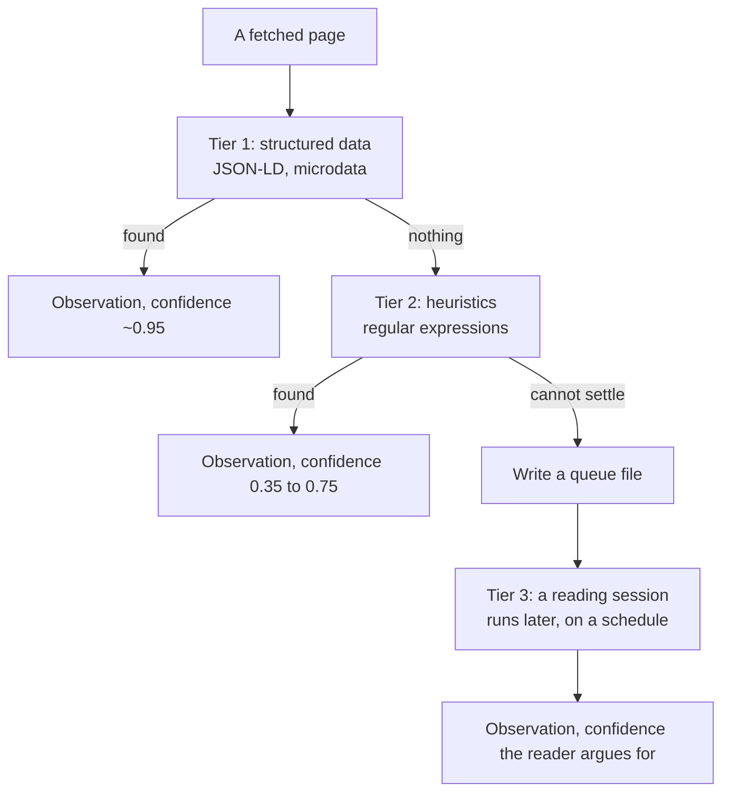
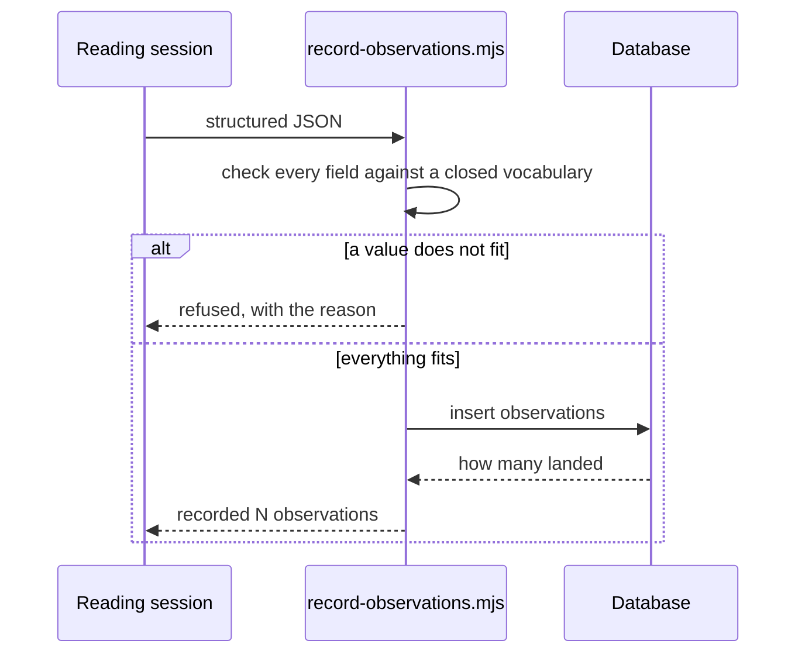
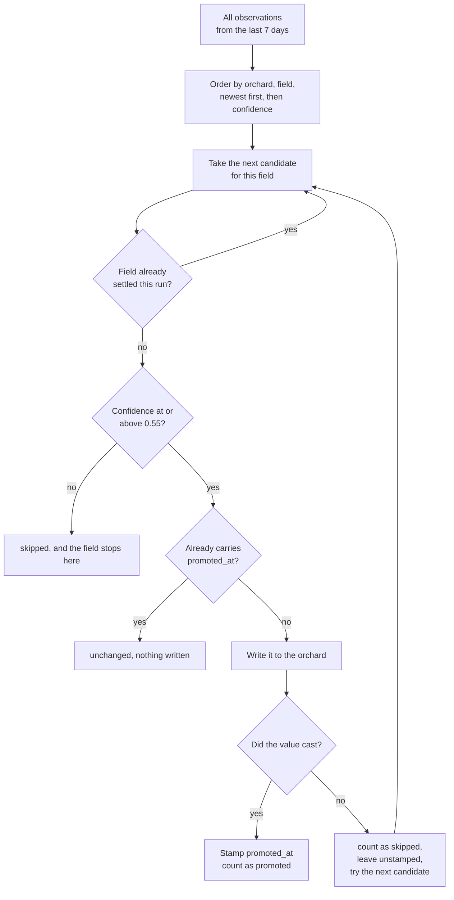
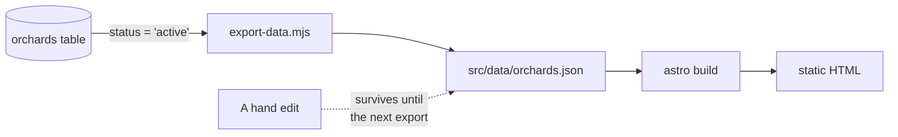
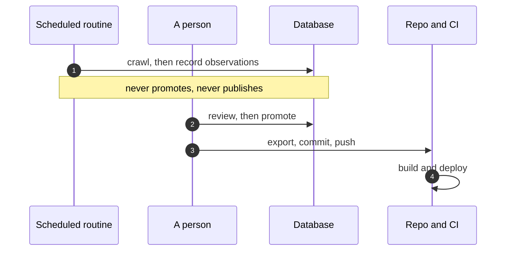

# The fact pipeline

How a sentence on a farm's website becomes a line on the map.

This is the core of the project. If you only read one page, read this one.

## The shape of it



The two highlighted boxes are the distinction everything else hangs off.

- An **observation** is *"this page said this, and here is how sure I am"*.
  Many observations can exist for the same field of the same farm. They are
  never deleted when a better one arrives; they accumulate.
- An **orchard row** is *"this is what the map tells people"*. One value per
  field.

Promotion is the gate between them, and it is the only thing that writes farm
facts. Nothing else in the codebase updates `orchards.hours`.

## Step 1: crawling

```bash
node scripts/scrape.mjs --limit 25 --queue
```

The crawler visits farm websites politely and saves what it finds. "Politely"
is doing real work here:



One request per host at a time, ever. During the season most farms answer `304
Not Modified` most nights, and that is the system working rather than the
system failing.

## Step 2: extraction, in three tiers

Not every sentence needs the same machinery. The crawler tries the cheap,
certain methods first and only escalates when they cannot answer.



| Tier | What it is | Typical confidence |
| --- | --- | --- |
| `structured` | The page published machine-readable data | 0.95 |
| `heuristic` | A regular expression matched a known phrase | 0.35 – 0.75 |
| `model` | A scheduled Claude session read the page | argued case by case |

The tiers are deliberately ordered by *cost and certainty together*. A farm
that publishes JSON-LD opening hours costs nothing to read correctly. A farm
whose hours are an image inside a carousel cannot be read by a regex at any
price, and that is what tier 3 is for.

<details>
<summary><b>Advanced:</b> why the low-confidence heuristics exist at all</summary>

Look at `scripts/lib/extract.mjs` and you will find a regex that emits
`upick_open: true` at confidence **0.35** — well below the 0.55 promotion
threshold, so it can never reach the map on its own.

That is not a mistake. It is a deliberate record that the page contains
open-shaped language, which is useful in two ways: it is evidence a human or
the reader tier can weigh, and it lets us measure how often the cheap tier
would have been right if we had trusted it. A tier that only ever emits things
it is sure of cannot be calibrated.

The asymmetry between `true` at 0.35 and `false` at 0.75 in the same file is
also intentional. "We are closed for the season" is stated plainly and rarely
by accident. "Open!" is a banner that stays up for months.
</details>

## Step 3: recording observations

The reading session cannot write SQL. Its only route into the database is one
validating script:

```bash
node scripts/record-observations.mjs <file.json>
```



The narrow gate matters because the session has been reading arbitrary
third-party HTML. If a farm's page could talk the reader into emitting a
surprising value, the blast radius has to end at *"one refused observation"*
rather than *"arbitrary statement executed against the database"*. See
[the routines page](./routines.md) for the rest of that boundary.

## Step 4: promotion

Promotion is a `security definer` function in the database, not application
code. It decides which observations become facts.



It returns three counters, and the difference between them is the point:

```json
{ "promoted": 0, "unchanged": 100, "skipped": 2 }
```

- **promoted** — what actually changed on this run.
- **unchanged** — already applied, left alone.
- **skipped** — below the threshold, or a value that would not cast.

<details>
<summary><b>Advanced:</b> four rules in that diagram that each cost a bug to learn</summary>

**The winner is chosen across *all* observations, not just unpromoted ones.**
This looks like a missed optimisation and it is not. `distinct on` over a
filtered set does not return nothing when the winner is excluded — it returns
the next row down. Restrict promotion to unstamped rows and every promoted
field gets handed to the newest observation that has *already lost*, so farms
drift backwards into stale values one run at a time while the counts look
healthy. `promoted_at` decides whether to write the winner. It does not get to
decide what the winner is.

**Recency outranks confidence.** The ordering is `created_at desc, confidence
desc`. Because `created_at` defaults to `now()`, which in Postgres is
transaction start time, every observation from one batch shares a timestamp and
confidence is what separates them. Across batches, the newer reading wins even
at lower confidence — a fresh 0.6 beats a two-day-old 0.9. That is intended:
the newer reading is about the farm as it is now.

**A cast failure falls through; a low-confidence reading does not.** If a value
will not cast, the next-best reading of that field gets its turn, because a
malformed string is a defect in the reader rather than a statement about the
farm. But a *below-threshold* newest reading stops the field dead, because
reaching past it to an older observation would publish stale information
precisely because the fresh information was poor.

**Failures are never stamped.** A `not-a-boolean` in `upick_open` is reported
as skipped on every single run until somebody fixes the reader. Swallowing it
after one report would turn today's small problem into somebody's confusing
problem in six months.

Varieties are the one field keyed differently: a farm grows many apples, so the
dedupe key includes the value. Without that, `distinct on (orchard_id, field)`
kept exactly one apple per farm and silently discarded the rest — 68
observations promoted 6, nothing failed, and the counts only looked wrong next
to each other.
</details>

## Step 5: export, and the trap

```bash
pnpm db:export -- --apply
```

The site is static and builds from `src/data/orchards.json`. That file is
**generated** from the database.



> **The trap.** Editing `src/data/orchards.json` works right up until the next
> export, which reverts it. This has caused three separate incidents: a phone
> number added to the file and not the database, three Connecticut farms
> deleted from the database while still in the file, and every importer's
> `--apply` writing to the file instead of the table.

The direction is now one-way, and every importer writes to the database. The
export also refuses to run when a farm would come off the map:

```
refusing to write: 1 farm would come off the map

    Ghost Orchard (ghost-orchard-nowhere)

If they were hidden on purpose, pass --allow-removals.
If not, they are missing from the orchards table and want restoring first.
```

<details>
<summary><b>Advanced:</b> why the guard is at the export and not at the delete</summary>

The export is the last place to notice, which is exactly why the check lives
there. The file and the table can part company any number of ways — a bad
delete, a half-run migration, a restore from the wrong snapshot — and all of
them arrive here, where the map loses a farm. A guard at any one upstream cause
would catch that cause only.

It was a printed count before it was a refusal. The summary said `no longer
published: 3` on the morning three farms were about to vanish, correctly, into
the middle of a longer job. A number in a report is only a safeguard for
somebody who reads it.
</details>

## Who runs each step



The boundary is deliberate. The reader records; **a person promotes**; the
export publishes. Each boundary is a place a wrong "picking is open" can be
stopped before somebody drives two hours on it.
