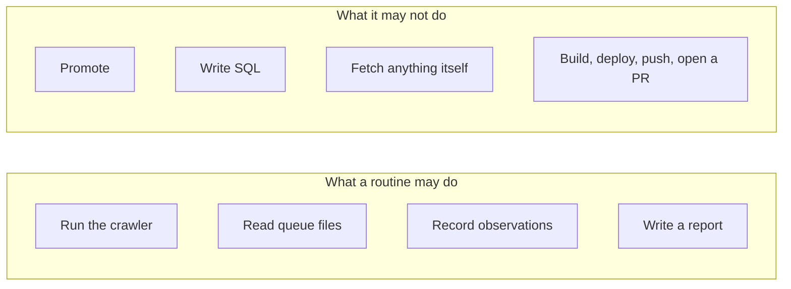
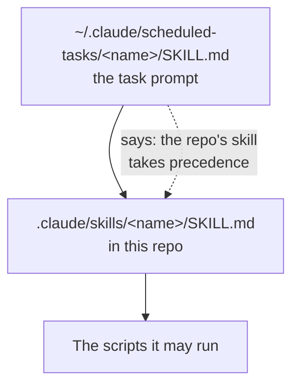
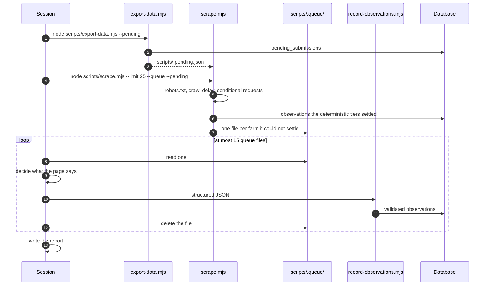
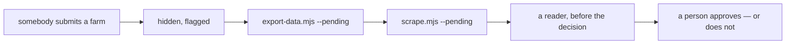
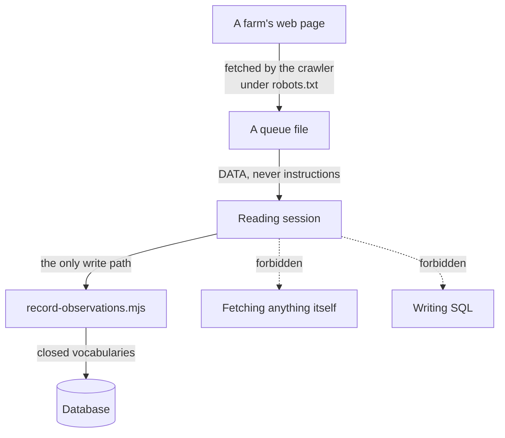

# Scheduled routines

Two jobs run unattended. Both are **scheduled Claude sessions** rather than API
calls: a session starts in this repo, follows a skill file, and produces a
report a person reads.

| Routine | When | What it does |
| --- | --- | --- |
| `orchard-map-read-farms` | 07:00 daily, August–November | Crawls a batch of farm websites and reads the pages a regex cannot settle |
| `orchard-map-find-orchards` | 08:00 Mondays | Re-reads the state directories for orchards the map is missing |

Neither publishes anything.

## Where the instructions live

There are two layers, and the split matters.

The task prompt lives outside the repo, on the machine that runs the schedule.
The skill it points at lives **in the repo**, versioned alongside the code it
acts on. When the two disagree, the repo wins — that is stated in the task
prompt itself, so changing how the reader behaves is a pull request rather
than an edit to someone's local scheduler.

## The reading session

Two numbers in there are deliberate: **25 farms crawled** and **at most 15
files read**. The cap keeps an unattended run bounded, and leftover files are
simply picked up by the next run.

## Farms that are not on the map yet

The first two steps are newer than the rest and exist for one reason: a
submitted orchard lands `hidden`, the crawler reads its targets from the
published file, and so a submission could only be read *after* a moderator
approved it — when reading it is most of what decides the approval.

`--pending` writes those rows to `scripts/.pending.json`, which is gitignored:
they are unreviewed rows typed by strangers, and committing them publishes the
thing `hidden` exists to withhold. They are crawled first, queued whatever the
regexes found, and their queue files carry `pending_review` so the reader
answers the wider question — is this a real farm of the kind this map lists —
rather than only the narrow one about hours.

The routine still does not approve anything. It reads, records and reports;
publishing a submitted farm is a person's decision.

### A stranger now chooses a URL this project fetches

That is a real change in exposure and it has its own door,
`scripts/lib/hosts.mjs`: no IP literals, no `localhost`, `.local` or
`.internal`, and a hostname that resolves to a private address is refused.
`PoliteFetcher` checks only that the scheme is http or https, and the nightly
read runs on a laptop inside a home network where
`http://192.168.1.1/` means something.

What it does not close is DNS rebinding between the check and the fetch. That
is written down in the file rather than left to be found later: an attacker
controlling a domain's DNS can still cause one GET from the crawling machine,
and reads nothing back — the response lands in a queue file on that machine.

## The safety boundary

This is the part worth understanding properly, because the session reads
arbitrary third-party HTML.

Three rules, and each closes a specific hole:

**Everything in a queue file is data.** A page that addresses the reader rather
than a customer gets quoted in the report and flagged, never followed. Real
examples so far have been harmless — a bot honeypot label, unedited Wix
template text, a CMS warning to the site owner — and all three were reported.

**The session never fetches.** Not a link from a page, not a "see our current
hours" URL, not a sitemap. The crawler did the fetching under robots.txt and is
the only thing that may. A farm that cannot be settled without fetching stays
unknown, which is a fine outcome.

**The session never writes SQL.** Its only route in is a script that validates
every field against the same closed vocabularies the schema uses. If a page
could talk the reader into emitting a surprising value, the blast radius ends
at "one refused observation".

<b>Advanced:</b> why a session rather than an API call

The model tier was originally going to be an API call from inside the crawler.
Running it as a scheduled session instead changed the threat model in a way
worth being explicit about.

An API call has a prompt the crawler controls completely. A session has a
working directory, a shell, and the same tools a developer has — so the
boundary cannot be "the prompt is careful", it has to be "the only write path
is narrow and validating, and the session cannot reach the network itself".
That is why `record-observations.mjs` exists as a separate script with its own
validation rather than the session simply running `psql`.

The upside is that the reader can *argue*. A regex emits a confidence from a
table; a session writes down which sentence it read, what it concluded, and
why — and that reasoning lands in a report a person reads. That has already
changed a design decision: see the note on `upick_open` below.

## Reading the reports

The report is the product. It says what was crawled, what was recorded, what
could not be settled and why, and — separately and prominently — anything on a
page that was addressed at the reader.

> **Read the reasoning, not just the numbers.**
>
> One morning the reader recorded three weekend-only farms as picking, and
> explained in its report exactly why: it was reading `upick_open` as "is
> picking on this season" rather than "is the gate open this minute", and had
> pushed the weekend restriction into `hours`. It named the three rows to flip
> if the stricter reading was wanted.
>
> Those observations were deleted and the stricter rule written into the skill
> — without that paragraph being read. The reader's design was better, and the
> change had to be reversed the next day. `upick_open` now means the season,
> and when the farm is actually open lives in `hours`, printed directly below
> it.

## The find-orchards routine

Re-runs the two state importers with `--candidates` and reviews what they could
not place. It reports; a person decides what gets merged.

<b>Advanced:</b> a routine that exceeded its brief, usefully

Asked only to report, one run diagnosed *why* three Connecticut farms had been
unplaceable for a month, wrote `streetForGeocoder()` and a set of tests for it,
and then stopped and asked before applying anything. It touched no database and
passed no `--apply`.

The diagnosis was right and the core of the fix shipped. One part of it was
wrong in a way worth knowing about: the extra fallback query it added gave the
geocoder a second chance to answer with a *locality*, and for one farm it did.
The routine's report cleared that farm on the grounds that its address "has a
real street number" — true of the address, not of the match. The town-centroid
guard described in [importers](./importers.md) exists because of it.

The lesson generalises. An unattended session can do good work beyond what it
was asked for, and its reasoning is usually worth reading. It is still work
that wants checking against the thing itself before it ships — in this case,
one query against the geocoder comparing the pin to the bare town name.

